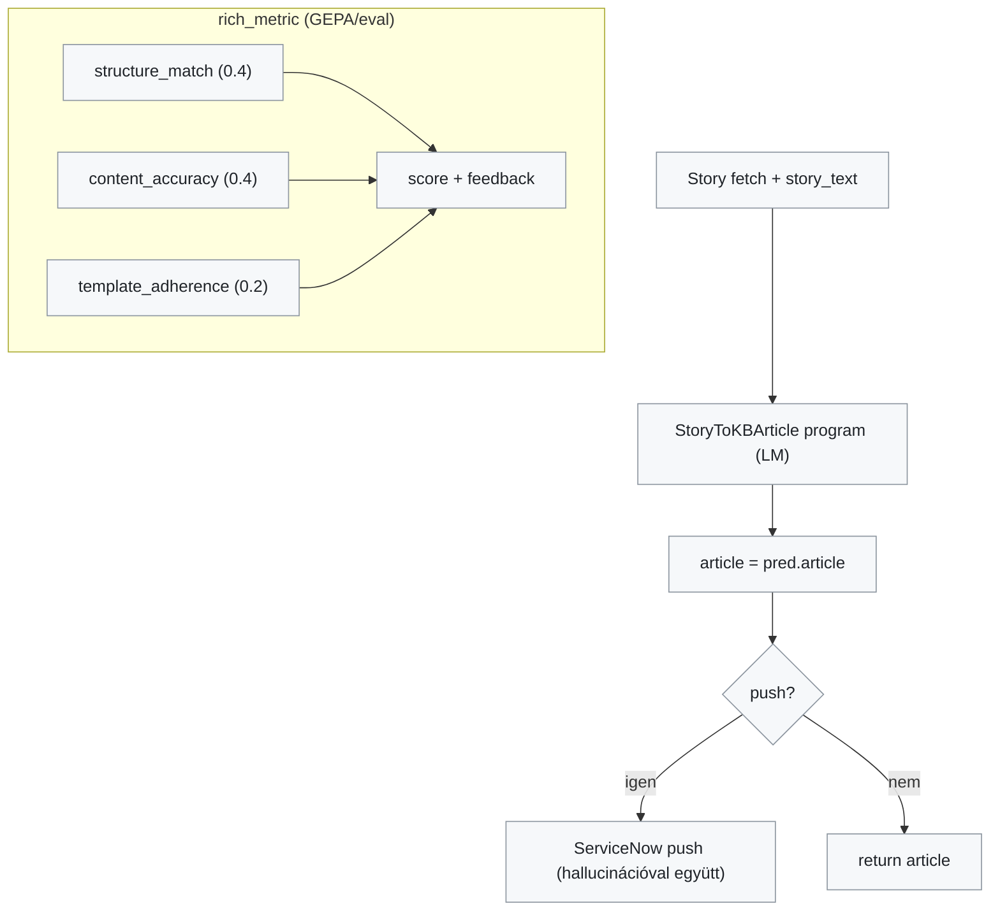
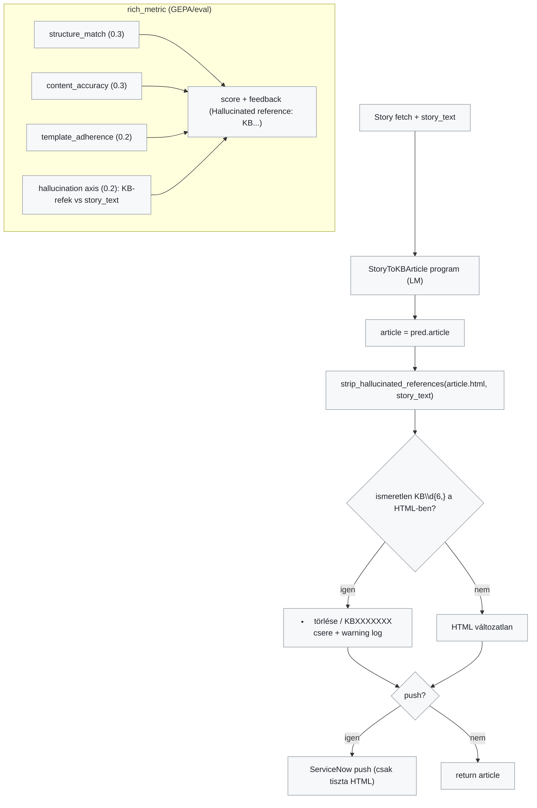
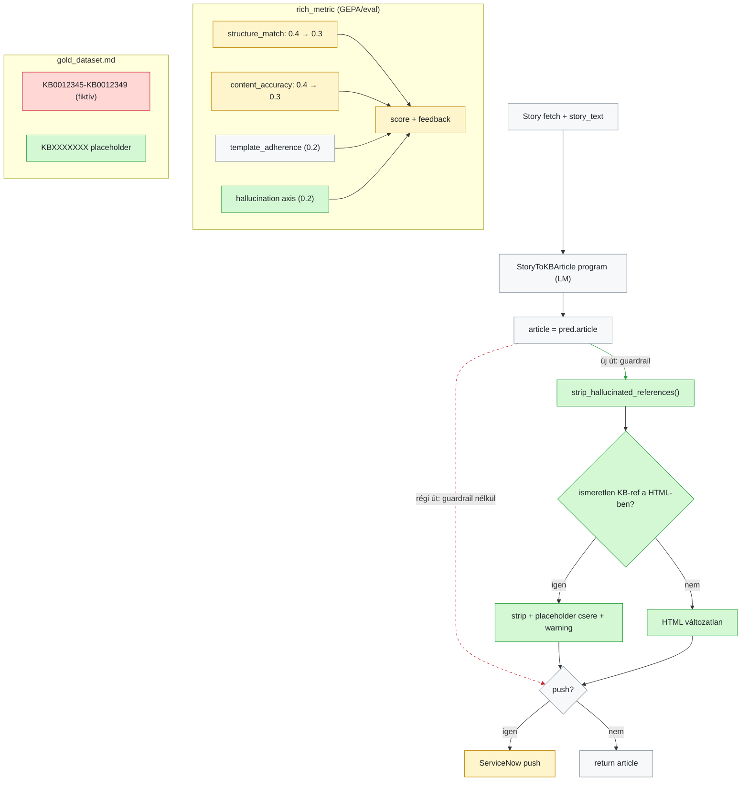

# Spec 004 — Hallucination-Free KB Generation: mi változott?

**Scope:** `bacdce8..HEAD` (spec 004 commitok) · **Lens:** control-flow
**Viselkedést hordozó fájlok:** `eval/metric.py`, `src/snow_kb/pipeline.py` (+ `data/examples/gold_dataset.md` adattisztítás, tesztek)

A változás két védelmi vonalat épít a hallucinált KB-hivatkozások (pl. fiktív `KB0012345`) ellen:
(1) a `rich_metric` új **hallucination axis**-a bünteti a GEPA optimalizáció alatt az ismeretlen KB cikkszámokat,
(2) a pipeline-ba beépült **`strip_hallucinated_references()` guardrail** push *előtt* eltávolít minden olyan KB hivatkozást, ami nem szerepel a forrás Story szövegében. Emellett a gold dataset fiktív cikkszámai `KBXXXXXXX` placeholder-re cserélődtek.

## Before (régi viselkedés)

## After (új viselkedés)

## What changed (merged diff view)

A zöld az új, a piros a megszűnt, a sárga a módosult elem; a szürke érintetlen. A szaggatott piros élek a régi, már nem létező útvonalak.

**Élszámozás (merged view):** 0: S→G, 1: G→A, 2: A⇢P (törölt), 3: A→GU (új), 4: GU→GUQ, 5: GUQ→STRIP, 6: GUQ→CLEAN, 7: STRIP→P, 8: CLEAN→P, 9: P→SN, 10: P→R.

## Notes

- **Módosult, nem új:** a `ServiceNow push` csomópont ugyanaz a kódút, de most már kizárólag guardrailen átment HTML-t kap — ezért sárga. A metric `score + feedback` összeállítása új feedback-ágat kapott ("Hallucinated reference(s): ...").
- **Súlyváltozás:** a metric tengelyek 0.4/0.4/0.2 → 0.3/0.3/0.2 (+0.2 hallucination) — ez szándékos trade-off: a nem-hallucinált output alapból kap 0.2-t (ld. `test_mismatch_returns_low_score` küszöb igazítása).
- **Kihagyva a diagramból:** `eval/gepa_optimize.py` CLI (`python -m eval.gepa_optimize`), a tesztek (8 új), és a szerver startup betöltés — ezek a spec 003-ban estek át a fő változáson; itt csak a hallucináció-specifikus viselkedés szerepel.
- **Eredmény:** baseline 0.386 → optimized 0.962 (tiszta adaton újrafuttatott GEPA), valset 0/2 hallucináció, éles cikk ServiceNow API-val verifikálva tisztán.
